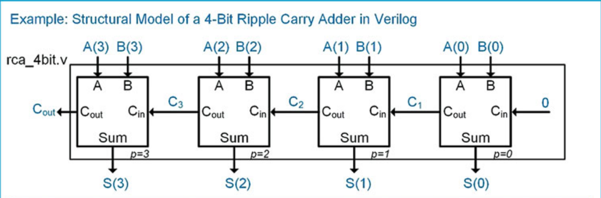

# verilog_4bit_rca

Verilog code for 4 bit ripple carry adder .
1. Module hierarchy : 
    1. Half adder : simple half adder which takes two inputs A and B , add them with each other and gives Carry and Sum values.
    1. Full adder : instead of using the following formula for adding 3 logical values we used two half adder to implement our full adder 
        1. Carry : A.B + A.C + B.C 
        1. Sum : A^B^C
    1. RCA adder : As it is shown in the picture , we used 4 full adder to add our values. 

